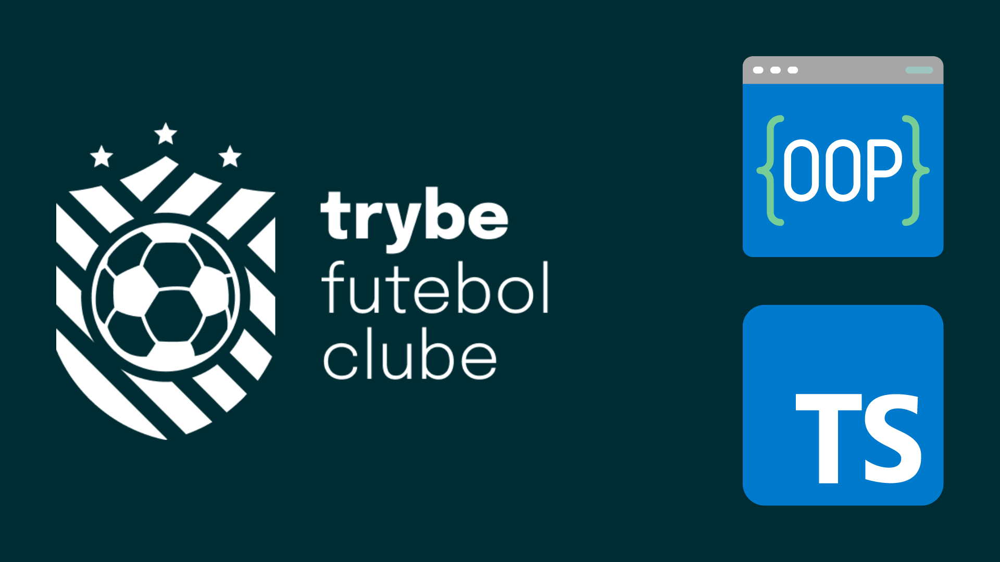
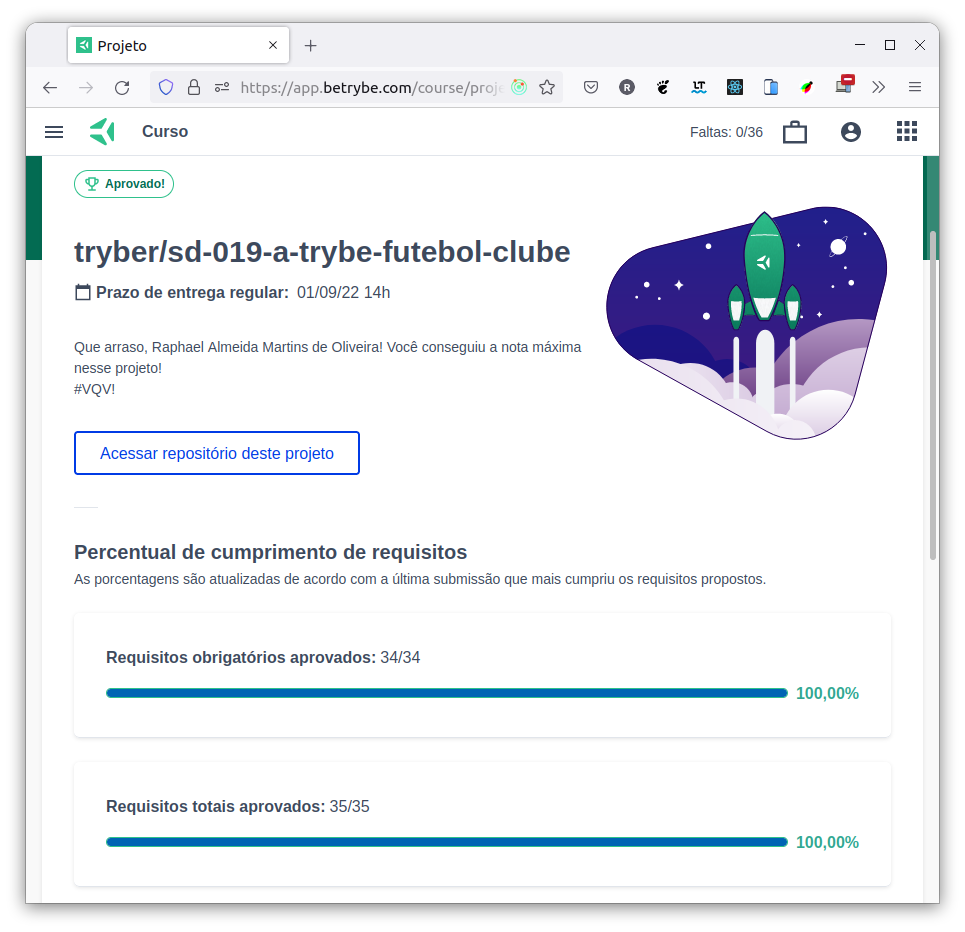

# :soccer: Trybe Futebol Clube (Soccer Club) :soccer:



## :page_with_curl: About/Sobre

<details>
  <summary markdown="span"><strong>:us: English</strong></summary><br />

Node.js, Express.js, TypeScript, OOP (Object-Oriented Programming) and SOLID project developed by [Raphael Martins](https://www.linkedin.com/in/raphaelameidamartins/) at the end of Unit 28 ([Back-end Development Module](https://github.com/raphaelalmeidamartins/trybe_exercicios/tree/main/3_Desenvolvimento-Back-end)) of Trybe's Web Development course. I was approved with 100% of the mandatory and optional requirements met.

We had to develop a RESTful API for a front-end application that was already developed. It's an application to check matches' data and the leaderboard of a soccer competition. It's possible to register and update matches. The authentication is handled with JSON Web Tokens. We also had to implement integration tests.
<br />
</details>

<details>
  <summary markdown="span"><strong>:brazil: Português</strong></summary><br />

Projeto de Node.js, Express.js, TypeScript, POO (Programação Orientada a Objetos) e SOLID desenvolvido por [Raphael Martins](https://www.linkedin.com/in/raphaelameidamartins/) ao final do Bloco 28 ([Módulo Desenvolvimento Back-end](https://github.com/raphaelalmeidamartins/trybe_exercicios/tree/main/3_Desenvolvimento-Back-end)) do curso de Desenvolvimento Web da Trybe. Fui aprovado com 100% dos requisitos obrigatórios e opcionais atingidos.

Tivemos que desenvolver uma API RESTful para uma aplicação front-end que já estava implementada. É uma aplicação para conferir dados de partidas e a classificação geral de timess em um campeonato de futebol. É possível cadastrar e atualizar partidas. A autenticação é feita com JSON Web Token. Também tivemos que implementar testes de integração.
<br />
</details>

## :man_technologist: Developed Skills/Habilidades Desenvolvidas

<details>
  <summary markdown="span"><strong>:us: English</strong></summary><br />

* Create classes, abstract classes and methods
* Define types and interfaces
* Use OOP concepts such as Abstraction, Encapsulation, Inheritance, Composition and Polymorfism
* Use SOLID principles, such as Single Responsability, Open/Closed, Dependency Inversion, Substitution (Liskov) and Interface Segregation
* Develop a Express.js application with TypeScript
* Use Sequelize.js with TypeScript
* Create a RESTful API
* Implement integration tests
<br />
</details>

<details>
  <summary markdown="span"><strong>:brazil: Português</strong></summary><br />

* Criar classes e classes e métodos abstratas
* Definir types e interfaces
* Utilizar conceitos de POO como: Abstração, Encapsulamento, Herança, Composição e Polimorfismo
* Utilizar princípios de SOLID como: Responsabilidade Única, Aberto/Fechado, Inversão de dependência, Substituição de Liskov e Segragação de Interfaces
* Desenvolver uma aplicação Express.js com TypeScript
* Utilizar o Sequelize.js com TypeScript
* Criar uma API RESTful
* Implementar testes de integração
<br />
</details>

## :hammer_and_wrench: Tools/Ferramentas

* TypeScript
* Node.js
* Express.js
* Sequelize.js
* MySQL
* React
* Mocha.js
* Chai.js
* Sinon.js
* Docker
* OOP (Object-Oriented Programming)
* SOLID

## :hammer_and_wrench: Installation and execution/Instalação e execução

<details>
  <summary markdown="span"><strong>:us: English</strong></summary><br />

To run this application you need to have **Git**, **Docker** and **Docker Compose** installed on your machine. Docker Compose needs to be at **1.29** version or superior.

### 1 - Clone the repository

```sh
git clone git@github.com:raphaelalmeidamartins/trybesmith.git
```

### 2 - Run the containers with the following script

```sh
npm run compose:up
```

### 3 - Access the front-end application


### 4 - Use one of the following credentials to login and test the app

#### Administrator

* email: admin@admin.com
* password: secret_admin

#### Regular user

* email: user@user.com
* password: secret_user

<br />
</details>

<details>
  <summary markdown="span"><strong>:brazil: Português</strong></summary><br />

Para rodar está aplicação é necessário ter **Git**, **Docker** e o **Docker Compose** instalados no seu computador. O Docker Compose precisa estar na versão **1.29** ou superior.

### 1 - Clone o repositório

```sh
git clone git@github.com:raphaelalmeidamartins/trybesmith.git
```

### 2 - Execute os containers

```sh
npm run compose:up
```

### 3 - Acesse a aplicação front-end na port 3000


### 4 - Utilize uma das credenciais abaixo para logar na aplicação e testar

#### Administrador

* email: admin@admin.com
* password: secret_admin

#### Usuário comum

* email: user@user.com
* password: secret_user

<br />
</details>

## :test_tube: Tests coverage/Cobertura de testes

<details>
  <summary markdown="span"><strong>:us: English</strong></summary><br />

Run the following command in the root directory of the project to check tests coverage:

```sh
cd ./app/backend/ && npm install && npm run test:coverage
```

Note: right now the tests cover about 99% of all the lines. I'll still implement a few more tests to reach 100% coverage.

<br />
</details>

<details>
  <summary markdown="span"><strong>:brazil: Português</strong></summary><br />

Execute o comando abaixo no diretório raiz do projeto para verificar a cobertura de testes.

```sh
cd ./app/backend/ && npm install && npm run test:coverage
```

Observação: no momento os testes cobrem cerca de 99% das linhas. Ainda implementarei mais alguns testes para atingir 100% de cobertura.
<br />
</details>

## :trophy: Grade/Nota


